# Node.js Application Deployment Using Jenkins CI/CD Pipeline on AWS EC2

##  Project Overview

This project demonstrates the complete CI/CD workflow for deploying a Node.js application using Jenkins Pipeline on AWS EC2.

The deployment process is fully automated using GitHub Webhooks. Whenever a developer pushes code to GitHub, Jenkins automatically triggers the pipeline, connects to the target EC2 instance using SSH, copies the latest application code, installs dependencies, and restarts the application using PM2.

---

# Project Architecture

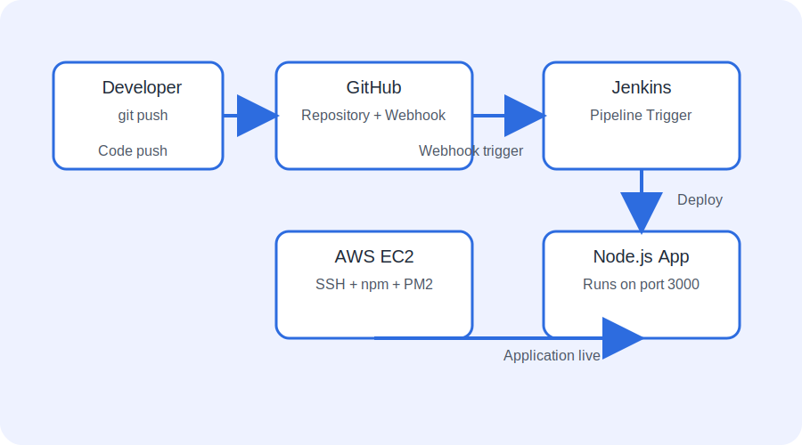

```text
Developer
    |
    | Push Code
    v
GitHub Repository
    |
    | GitHub Webhook
    v
Jenkins Server
    |
    | Jenkins Pipeline
    |
    | SSH + SCP
    v
Node.js EC2 Server
    |
    | npm install
    | PM2 restart
    v
Application Running on Port 3000
```

---

#  Technologies Used

* AWS EC2
* Ubuntu Linux
* Jenkins
* Jenkins Pipeline
* GitHub
* GitHub Webhooks
* SSH Agent Plugin
* Git Plugin
* Node.js
* NPM
* PM2
* Groovy

---

# Step 1: Install Required Jenkins Plugins

Go to:

```
Manage Jenkins
       |
       Plugins
       |
       Available Plugins
```

Install the following plugins:

* GitHub Plugin
* SSH Agent Plugin
* Pipeline Plugin

### GitHub Plugin Screenshot

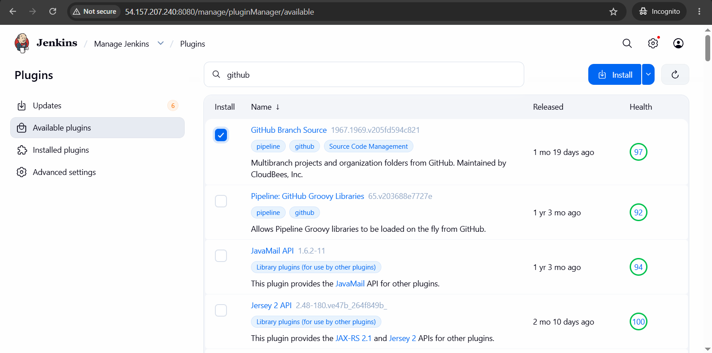

### SSH Agent Plugin Screenshot

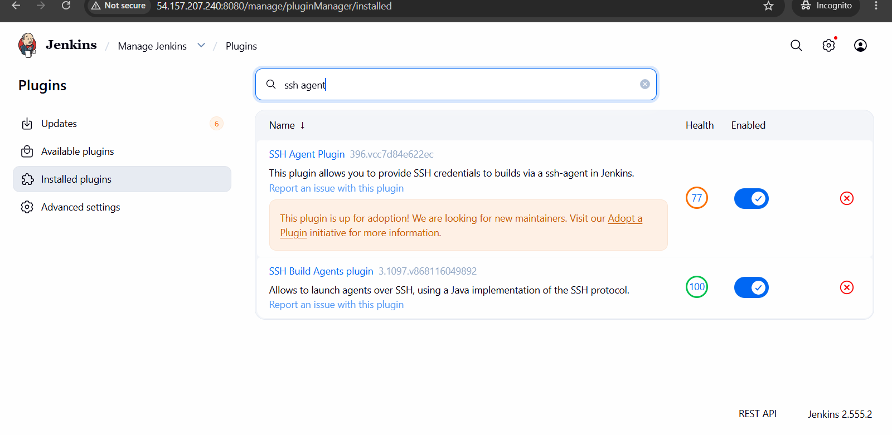

### Pipeline Plugin Screenshot

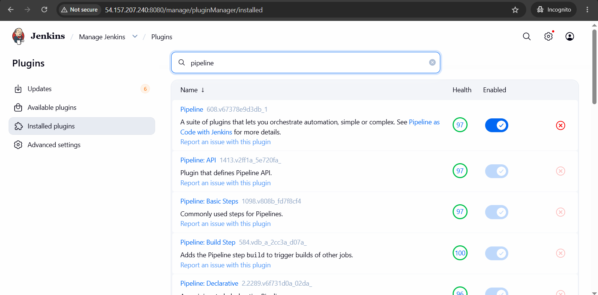

---

# Step 2: Create New Pipeline Job

Go to Jenkins Dashboard and click on **New Item**.

Enter:

* Job Name: `node-app-deploy`
* Select: Pipeline

Screenshot:

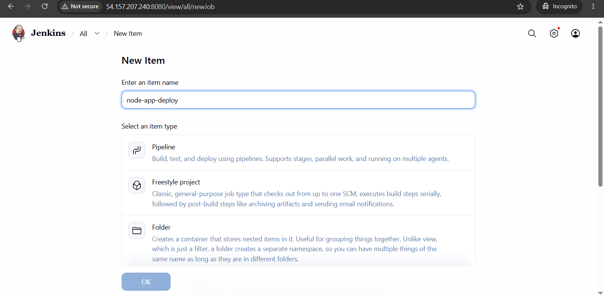

Click **OK**.

---

# Step 3: Configure Pipeline from SCM

In the Pipeline section:

* Definition: Pipeline script from SCM
* SCM: Git

Screenshot:

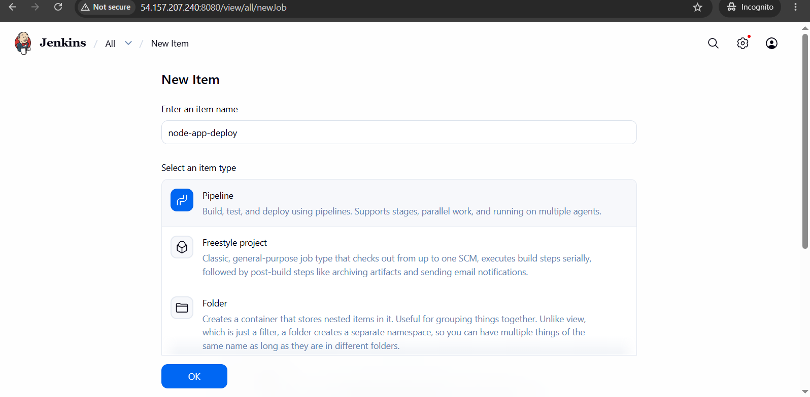

Enter your repository URL:

```
https://github.com/narwadesonali7/node-app-jenkins-pipeline.git
```

Screenshot:

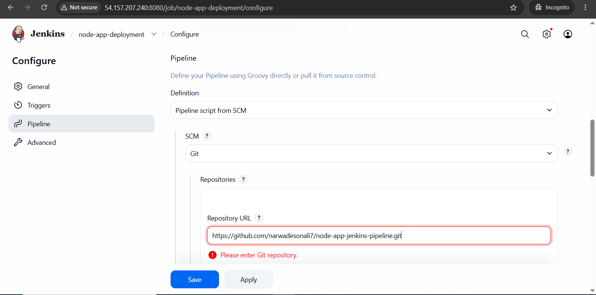

---

# Step 4: Add SSH Credentials in Jenkins

Navigate to:

```
Manage Jenkins
        |
        Credentials
        |
        Add Credentials
```

Screenshot:

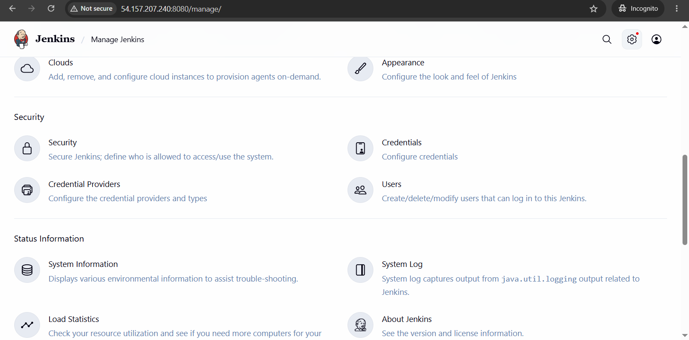

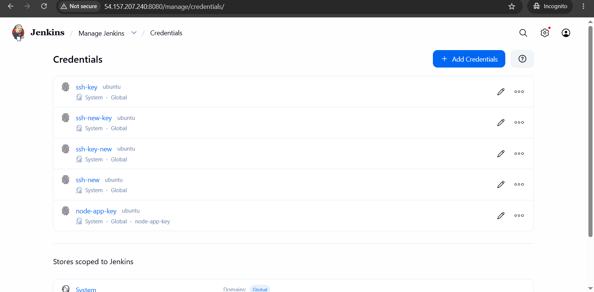
Select:

```
SSH Username with private key
```
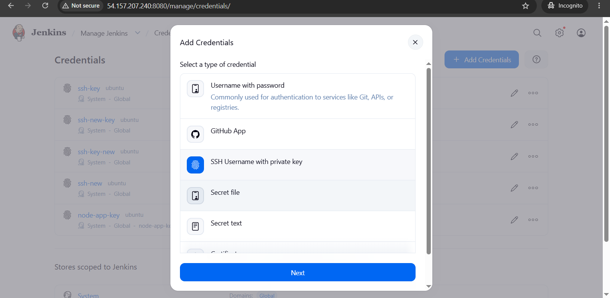
Screenshot:


---

# Step 5: Configure SSH Credential Details

Fill the details:

* ID: `node-app-key-deploy`
* Description: `node-app-key-deploy`
* Username: `ubuntu`
* Private Key: Enter directly and paste your EC2 private key

Screenshot:

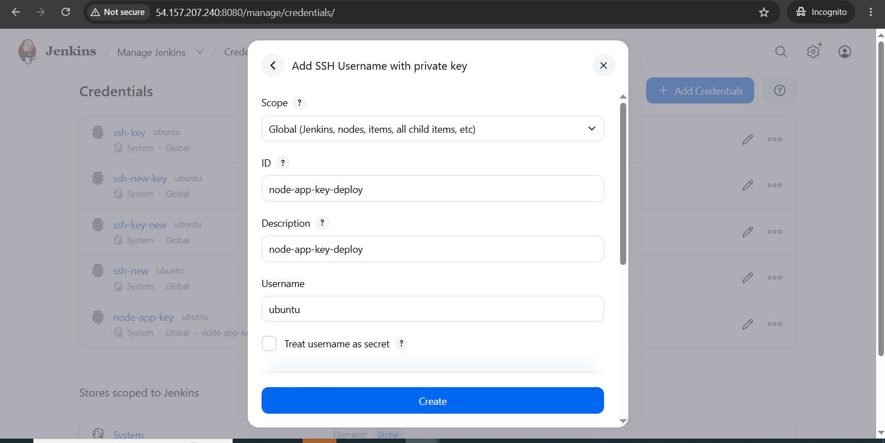

Click **Create**.

---

# Step 6: Configure Jenkinsfile Path

In the Pipeline configuration:

```
Script Path: jenkinsfile
```

Screenshot:

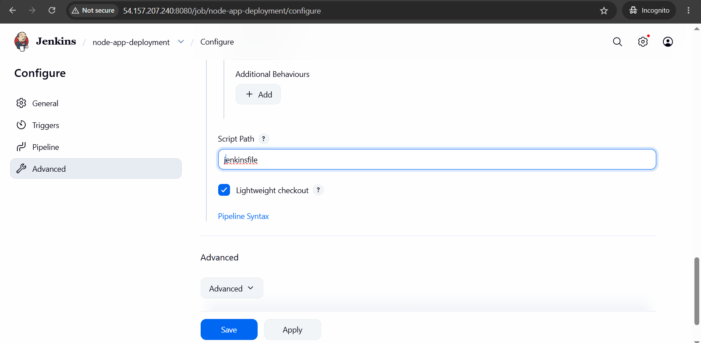
Click **Save**.

---

# Step 7: Execute Jenkins Pipeline

Click:

```
Build Now
```

Jenkins performs the following actions:

1. Downloads Jenkinsfile from GitHub.
2. Clones the Node.js application repository.
3. Creates SSH connection with Node.js EC2 server.
4. Copies application files using SCP.
5. Installs Node.js dependencies using npm.
6. Starts or restarts the application using PM2.

Build Console Output:

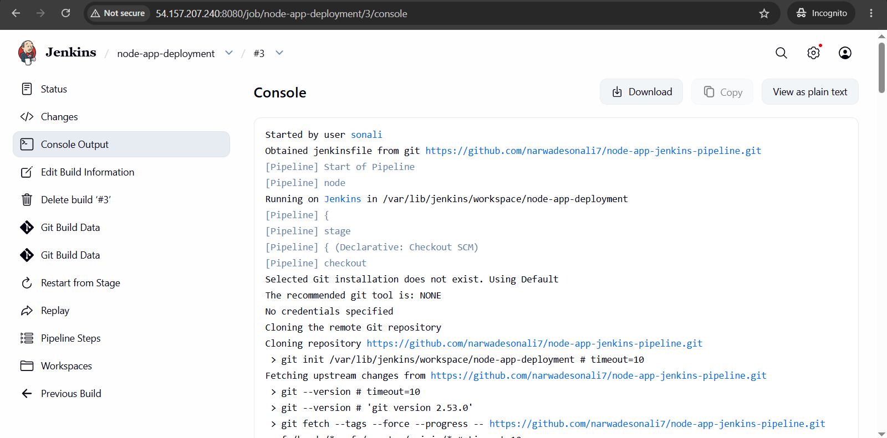

---

# Step 8: Verify Build Status

A successful Jenkins build shows a green status.

Screenshot:

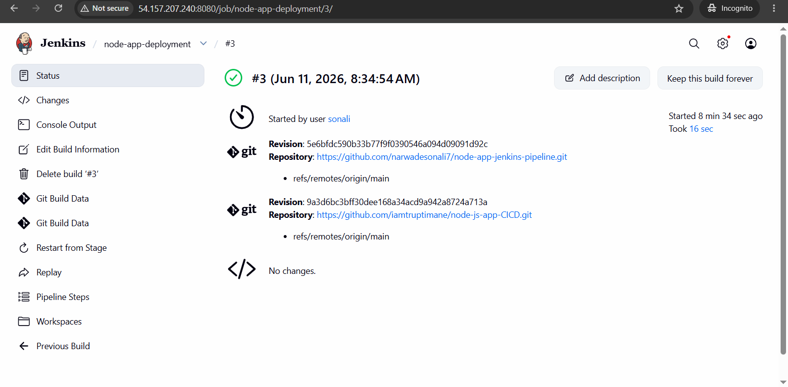

---

# Step 9: Enable GitHub Webhook Trigger in Jenkins

Open your Jenkins Job.

Navigate to:

```
Configure
      |
      Triggers
      |
      GitHub hook trigger for GITScm polling
```

Enable the checkbox and click **Save**.

Screenshot:

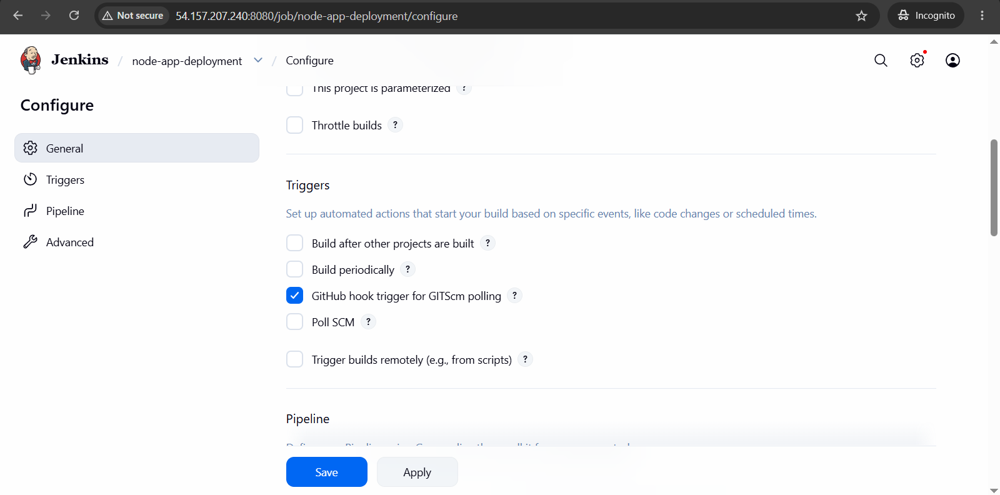

---

# Step 10: Configure GitHub Webhook

Open your GitHub Repository.

Navigate:

```
Settings
    |
    Webhooks
```

### GitHub Settings

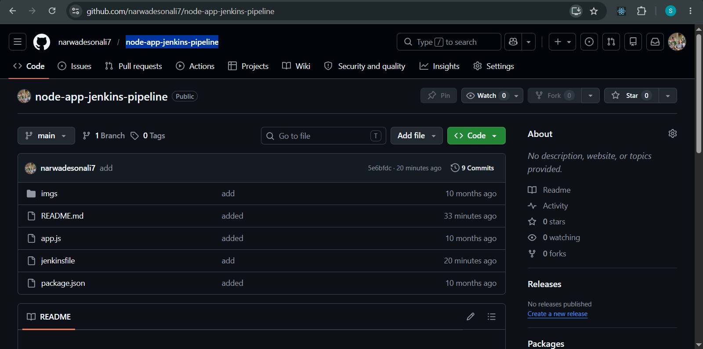

### Webhook Page

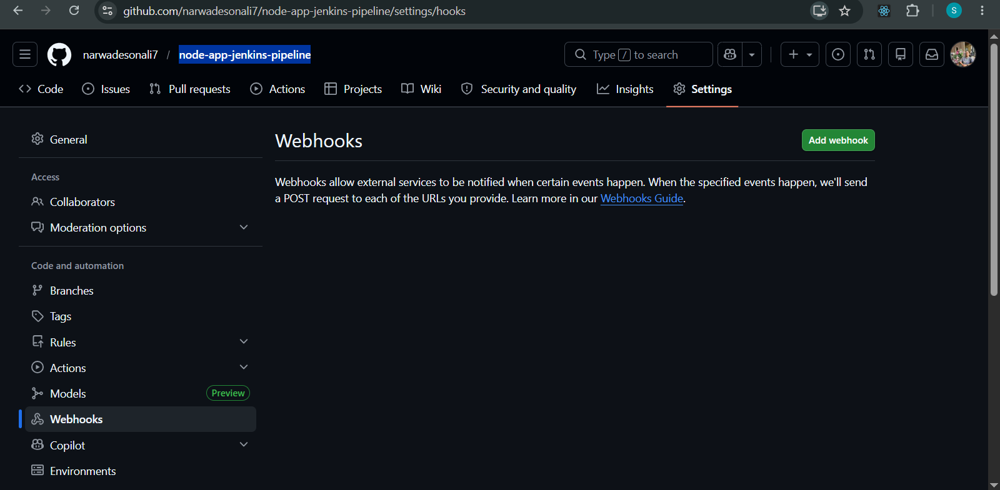
Click:

```
Add Webhook
```

Screenshot:

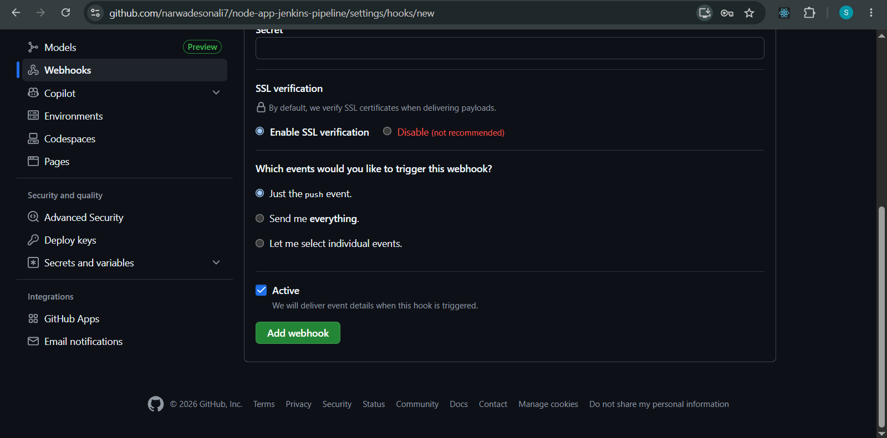

---

# Step 11: Add Payload URL

Enter Jenkins webhook URL:

```
http://54.157.207.240:8080/github-webhook/
```

Configuration:

* Content Type: `application/json`
* Events: Just the push event
* Enable Active

Screenshot:

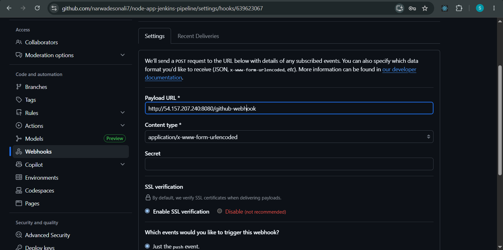

---

# Step 12: Verify Webhook Delivery

After adding the webhook, GitHub sends a test request.

Successful message:

```
Last delivery was successful
```

Screenshot:

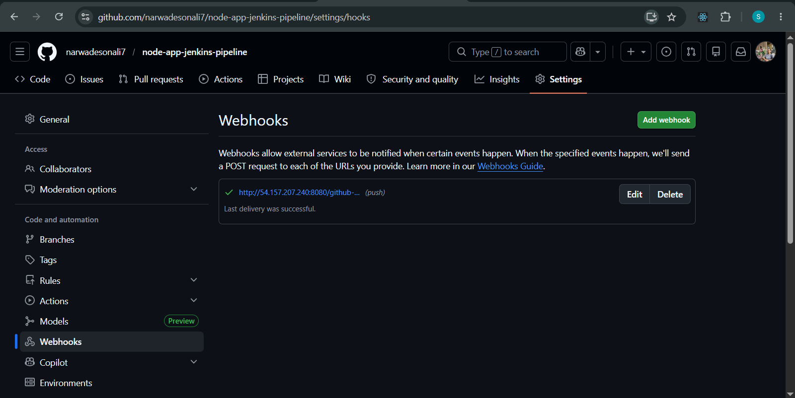

---

# Step 13: Test Automatic Deployment

Make changes in the Node.js application.

Example:

```
app.js
```

Commit and push the changes:

```bash
git add .
git commit -m "Updated application"
git push origin main
```

After pushing:

1. GitHub sends a webhook request.
2. Jenkins automatically triggers the pipeline.
3. Jenkins executes the Jenkinsfile.
4. New code is deployed to the EC2 server.
5. PM2 restarts the application.

---

# Step 14: Access the Live Node.js Application

Open your browser:

```
http://98.85.224.231:3000
```
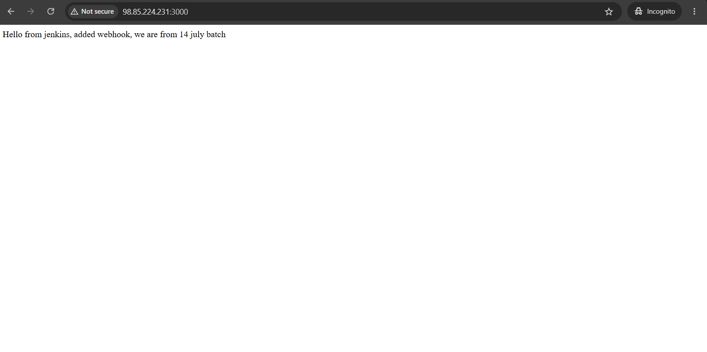

The application is successfully deployed and accessible publicly.

---

# Complete CI/CD Workflow

```text
Developer
    |
    | git push
    v
GitHub Repository
    |
    | Webhook Trigger
    v
Jenkins Pipeline
    |
    | SSH Authentication
    v
EC2 Node.js Server
    |
    | Copy Files
    | npm install
    | PM2 restart
    v
Application Live
```

---

# Useful PM2 Commands

### Check running applications

```bash
pm2 list
```

### View application logs

```bash
pm2 logs node-app
```

### Restart application

```bash
pm2 restart node-app
```

### Stop application

```bash
pm2 stop node-app
```

### Delete application

```bash
pm2 delete node-app
```

---

#  Key Learnings

After completing this project, I gained hands-on experience with:

* AWS EC2 Server Management
* Linux Commands
* Node.js Environment Setup
* Jenkins Installation and Configuration
* Jenkins Pipeline Creation
* Git and GitHub Integration
* SSH Authentication
* GitHub Webhooks
* CI/CD Automation
* PM2 Process Management

---


